# Revenue Maximisation: A Data-Driven Strategy for Growing Revenue in a Multinational Consumables and Instruments Business

**Group 5** — Arhant Doongarwal (05), Hriman Saha (011), Lakshita Purwar (016), Ravi Pratap Singh (022), Shreyit Sinha (027), Wali Abidi (032)
*Introduction to Python Programming, Tata Institute of Social Sciences — May 4, 2026*

📓 [Notebook](notebooks/revenue_maximisation_analysis.ipynb) · 📄 [Original PDF report](report/Revenue_Maximisation_Report_Group5.pdf)

---

## Executive Summary

This report presents the findings and recommendations of Group 5's data science analysis of a multinational consumables and instruments business. The analysis was conducted on approximately 1.99 million cleaned transaction records spanning FY2023 to FY2026, representing $7.39 billion in total revenue.

The business is on a declining trajectory. FY2024 was the peak revenue year and the decline has continued into FY2026. A Facebook Prophet forecast projects revenue falling from $1.93 billion in FY2027 to $1.05 billion by FY2029 if no action is taken. The root cause is not pricing or product quality. It is customer attrition: 39.3% of FY2023 customers had not reordered by FY2025, placing $431 million in historical revenue at risk.

Seven data-backed recommendations were identified with a combined estimated upside of **$1.12 billion** above the business-as-usual forecast. Implementing these strategies lifts projected FY2028 revenue from $1.72 billion to $2.18 billion. All estimates use conservative assumptions.

The three highest-priority actions are protecting top accounts, reversing churn, and cross-selling Instruments to consumables-only accounts. These are executable within six months and represent $352.88 million in combined upside.

### Six-Month Implementation Roadmap

| Phase | Months | Actions | Target Metric |
|---|---|---|---|
| **Stabilise** | 1–2 | Assign account managers to top 2,642 customers. Launch re-engagement campaign targeting 6,620 churned FY2023 customers, prioritising those lapsed within 18 months. | Number of churned accounts placing repeat orders within 60 days |
| **Activate** | 3–4 | Begin instrument cross-sell campaign targeting top 20% of consumables-only accounts by spend (approx. 3,172 accounts). Begin internal SKU rationalisation review; identify bottom 50% of catalogue by revenue for potential discontinuation. | Number of accounts converted to multi-product buyers |
| **Scale** | 5–6 | Pre-position inventory for October fiscal peak using Prophet seasonal decomposition. Set AOV improvement targets for the two most underperforming region groups. Commission BCG divisional restructuring review to redirect Dog division budget to BCD Star. | October revenue vs. Prophet baseline; AOV in target regions vs. prior year |

---

## 1. Problem Statement

Revenue growth is a core challenge, and data science is essential for diagnosing underperformance and prescribing interventions, which has become a core competency of modern data science teams (Davenport & Harris, 2007). This report addresses a revenue maximization problem set by senior leadership, utilizing transactional sales data spanning FY2023–FY2026 to generate concrete, data-backed strategies. The central research goal is to use analytical techniques to identify and quantify the primary drivers of revenue decline and suggest strategic interventions to reverse it. The entire analysis is positioned as an applied business problem, requiring all findings to be translated into actionable business language and every recommendation to be grounded in quantified evidence.

This central goal is supported by five subsidiary questions covering key areas: customer retention and segmentation for churn risk; product class heterogeneity and cross-sell opportunities; time-series forecasting to compare the business-as-usual trajectory against a strategy-adjusted scenario; geographic revenue variance and the size of the addressable gap; and how BCG portfolio classification informs resource allocation via internal divisions. The overall scope focuses on assessing the current state, identifying growth/decline drivers, quantifying opportunities/leakages, constructing a demand forecast baseline, and ultimately developing a prioritized set of seven cost-based recommendations.

## 2. About the Data

### 2.1 Dataset Description

The dataset is a Parquet-format file containing transactional sales records from a multinational consumables and instruments business. In its raw form, the dataset contains 2,421,385 rows and 16 columns, covering orders placed between January 1, 2023 and April 24, 2026. This represents approximately 3.3 fiscal years of business activity, with FY2026 constituting a partial year up to the data cutoff date. Each row in the raw dataset represents a single order line, capturing the customer, product, revenue, quantity, geographic location, and date associated with each transaction.

**Table 1: Column Dictionary for the Raw Sales Dataset**

| Column Name | Description |
|---|---|
| `order_number` | Unique identifier for each sales order |
| `product_class` | Type of product sold: Consumables or Instruments |
| `cdm_duns_name` | Name of the direct buying customer entity |
| `cdm_parent_duns_name` | Parent company name, grouping subsidiaries under one ultimate parent |
| `amount_p$` | Revenue generated from the order, in USD |
| `cdm_end_market` | Industry vertical the customer operates in (e.g., pharma, hospital) |
| `division` | Internal business division to which the product belongs |
| `order_create_date` | Date the order was created in the system |
| `fiscal_year` | Fiscal year recorded in the system (FY2023 to FY2026) |
| `hfm_region` | Geographic reporting region (16 distinct regions) |
| `hfm_region_group` | Higher-level geographic grouping (8 region groups) |
| `sku_name` | Product name or description |
| `sku_number` | Unique product code or SKU identifier |
| `quantity` | Number of units sold in the order line |
| `ship_to_number` | Identifier for the shipping destination |
| `ship_to_name` | Name of the site or location receiving the order |

The dataset covers 30,906 unique customer entities, 145,429 unique SKUs, 24 internal business divisions, 12 end market verticals, 16 HFM geographic regions grouped into 8 region groups, and 844,786 unique order numbers.

### 2.2 Data Preprocessing and Cleaning

The initial data cleaning pipeline prioritized auditability and data integrity. This involved standardizing column names to snake_case (e.g., renaming `amount p$` to `amount_usd`), casting numeric fields like `amount_usd` and `quantity` to `float64` for mathematical operations, and ensuring `order_create_date` was a proper datetime object for time-series analysis. Critically, 1,748 records with incorrect fiscal year assignments were identified and corrected based on the company's October-to-September fiscal calendar.

**Table 2: Distribution of Orders by Derived Fiscal Year After Correction**

| Fiscal Year | Order Count |
|---|---|
| FY2023 | 621,666 |
| FY2024 | 756,373 |
| FY2025 | 705,085 |
| FY2026 (partial) | 338,261 |

The raw dataset required extensive cleaning, starting with aggregating 414,351 records that shared duplicate order and SKU combinations but had split line item values. This aggregation, achieved by summing `quantity` and `amount_usd`, reduced the dataset by 17.9% to 1,988,532 rows. Subsequent steps removed rows with zero or negative `amount_usd` (representing returns/cancellations), filtered out entries with quantity less than one (which produce invalid sales or undefined unit prices), and handled extreme anomalies, including a single outlier order valued at $112,340,132.

**Table 3: Summary of the Data Cleaning Pipeline**

| Stage | Row Count | Change |
|---|---|---|
| Raw dataset | 2,421,385 | Baseline |
| After duplicate aggregation | 1,988,532 | −432,853 (−17.9%) |
| After zero-revenue and invalid quantity removal | 1,988,532 | Negligible net change |
| After anomaly and outlier handling | 1,988,532 | −2 anomaly rows removed |
| **Final cleaned dataset** | **1,988,532** | **−432,853 total (−17.9%)** |

Three analytical features were added to the cleaned dataset. A `unit_price` column was computed as `amount_usd` divided by `quantity`, providing a per-unit revenue value for price elasticity analysis. A `revenue_band` column was created using fixed-threshold bins to segment transactions by size without relying on percentile-based cutoffs.

### 2.3 Descriptive Statistics

**Table 4: Descriptive Statistics for Revenue and Quantity (Cleaned Dataset, n = 1,988,532)**

| Statistic | `amount_usd` (USD) | `quantity` (units) |
|---|---|---|
| Mean | $3,661.58 | 23.69 |
| Median (50th percentile) | $257.00 | 2.00 |
| Standard Deviation | $57,270.94 | 671.36 |
| 25th Percentile | $83.00 | 1.00 |
| 75th Percentile | $841.00 | 4.00 |
| Maximum | $10,588,288.00 | 500,000.00 |

The large difference between the mean ($3,661) and the median ($257) for `amount_usd` confirms that the revenue distribution is heavily right-skewed. Most orders are small transactions, while a small number of very large orders pull the mean significantly upward. This skewness is an important context for all subsequent revenue analyses and explains why log transformations were applied in the regression models described in Section 3.3.

## 3. Exploratory Data Analysis

The exploratory data analysis (EDA) phase was structured to answer progressively deeper questions about the business. The team began with high-level revenue trend analysis and moved toward more granular segmentation and pattern identification. This section summarises the key findings from each analytical subsection in the companion notebook.

### 3.1 Revenue Trend Analysis (Code Section 2.3)

Total revenue was aggregated by fiscal year to identify the overall business trajectory. FY2024 represents the peak revenue year for the business. A clear decline is visible from FY2024 to FY2025, and FY2026 data, while partial, suggests the declining trend is continuing. This downward trajectory is not explained by a reduction in product availability or a structural shift in the product mix, as Section 3.9 demonstrates that the Consumables-to-Instruments revenue split has remained broadly stable across all four fiscal years. The revenue decline is therefore primarily driven by customer losses, a conclusion supported directly by the churn analysis in Section 3.6.

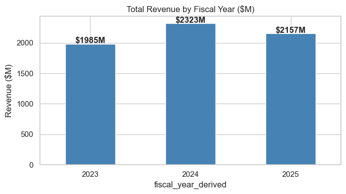
*Figure 1: Total revenue by fiscal year. FY2026 is a partial year (data cutoff April 2026).*

### 3.2 Seasonality Analysis (Code Section 2.4)

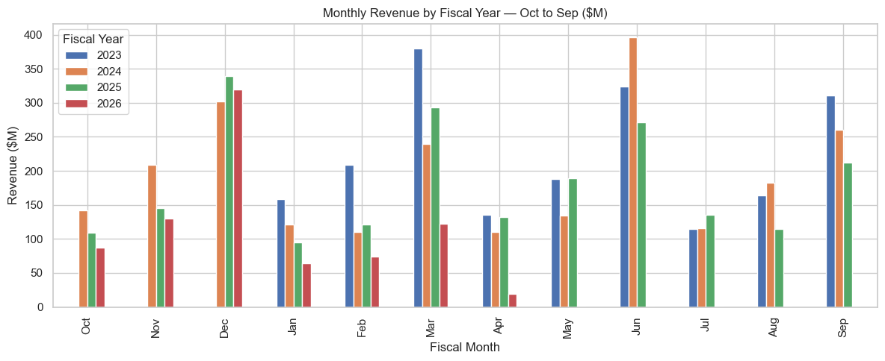
*Figure 2: Monthly revenue by fiscal year (October–September fiscal calendar). December and March consistently show the highest revenue.*

Monthly revenue analysis identified a consistent peak during the October to December window at the start of each fiscal year, with a secondary peak in March. The October–December peak likely reflects new budget releases from B2B customer organizations, who tend to concentrate purchases at the beginning of their budget cycles. The March peak likely reflects fiscal year's end spend before September closures. The practical implication is that the business must ensure maximum inventory readiness and sales team availability during these two windows to capture demand that would otherwise go to competitors.

### 3.3 Regional OLS Regression and Geographic Gap Analysis (Code Section 2.1 & 2.2)

A log-log Ordinary Least Squares (OLS) regression was used to determine what drives differences in revenue across the 16 geographic regions. The model regressed the natural logarithm of total regional revenue against the natural logarithm of total regional order count. The log-log specification was chosen because it linearises multiplicative relationships and allows the slope coefficient to be interpreted directly as an elasticity, a standard approach in applied econometrics (Wooldridge, 2012).

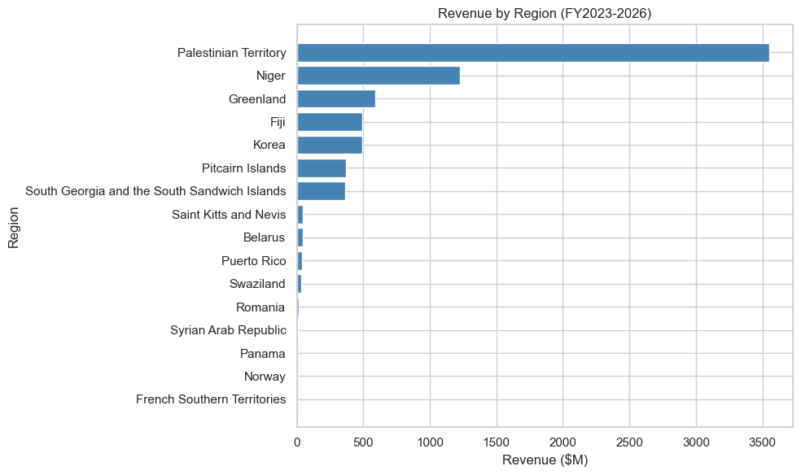
*Figure 3: Log-log OLS regression of total regional revenue against regional order count (R² = 0.93).*

The model produced an R-squared of 0.93, indicating that order volume alone explains 93% of the variation in regional revenue. This means that regional underperformance is primarily a volume problem: regions that receive fewer orders generate less revenue, not because their customers spend less per order on average, but simply because they process fewer orders. A second OLS model, controlling for product class and region, confirmed that instrument orders carry an estimated **10.47 times revenue premium** over comparable consumable orders, holding quantity constant. This multiplier was stored as a variable and used in the cross-sell opportunity calculation in Section 3.10.

Building on the OLS finding, a geographic gap analysis benchmarked each region's average revenue per order against the highest-performing region. The gap was then multiplied by each region's total order count to produce a dollar estimate of the revenue opportunity in each region. Capturing 30% of the total geographic gap represents a material revenue addition achievable without acquiring a single new customer.

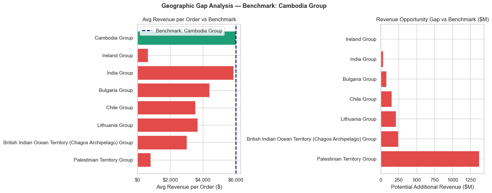
*Figure 4: Left: Average revenue per order by region group vs. benchmark. Right: Total dollar opportunity gap by region group.*

### 3.4 BCG Portfolio Analysis by Division (Code Section 3.1)

The Boston Consulting Group (BCG) Matrix (Henderson, 1970) was applied at the division level to classify each of the 24 internal business divisions into one of four strategic categories. Revenue share was used as a proxy for market position, and year-on-year revenue growth between FY2024 and FY2025 was used as the growth dimension. Quadrant thresholds were set at the median values of both dimensions.

**Table 5: BCG Matrix Classification of Business Divisions (FY2024 to FY2025)**

| BCG Quadrant | Count | Meaning |
|---|---|---|
| Star (high share, high growth) | 1 | Strong current position and growing. Invest to maintain momentum. |
| Cash Cow (high share, low growth) | 5 | Mature, high-revenue divisions. Protect and use surplus to fund growth. |
| Question Mark (low share, high growth) | 6 | High potential but uncertain. Selective investment warranted. |
| Dog (low share, low growth) | 12 | Low revenue and declining. Review for restructuring or resource reallocation. |

The dominance of Dog and Cash Cow classifications (17 out of 24 divisions) confirms that the portfolio is skewed toward mature, low-growth products. Only one division qualifies as a Star. This means the business has very limited natural growth engines in its current portfolio and must actively invest in high-growth divisions rather than relying on organic momentum to recover revenue.

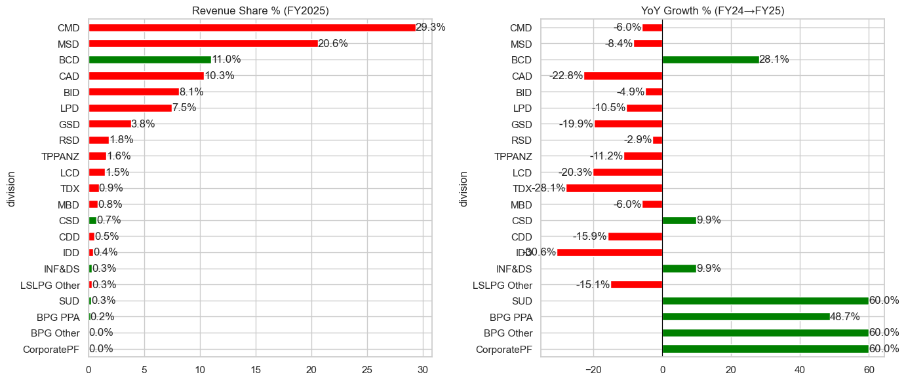
*Figure 5: Revenue share percentage and year-on-year growth rate by division, colour-coded by BCG quadrant.*

### 3.5 Price Elasticity Analysis (Code Section 3.2)

Price elasticity of demand describes the responsiveness of quantity demanded to a change in price (Marshall, 1890). A negative slope in a log-price versus log-quantity scatter indicates elastic demand; a near-zero or positive slope indicates inelastic demand. SKU-level elasticity was estimated using SKUs with at least ten orders to ensure statistical reliability.

The analysis found that Instrument SKUs exhibited flatter price-quantity relationships than Consumable SKUs, consistent with the observation that instrument buyers in B2B laboratory contexts are less price-sensitive. This is expected behaviour: in markets where product specification and compatibility constrain switching, demand tends to be inelastic (Kotler & Keller, 2016). The practical output was a ranked list of the most inelastic SKUs, which are the safest candidates for a pricing review, since modest price increases are unlikely to result in a proportional loss of volume.

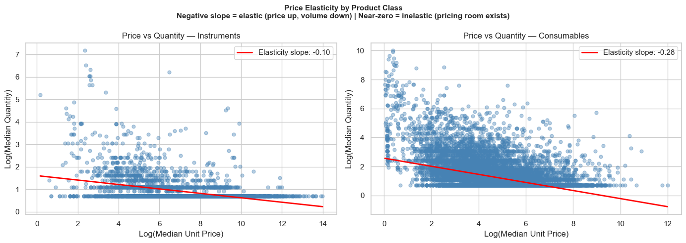
*Figure 6: Log unit price vs. log quantity for Consumables (left) and Instruments (right). A shallower slope indicates lower price sensitivity.*

### 3.6 Customer Concentration and Churn (Code Section 3.3, 3.4 & 3.5)

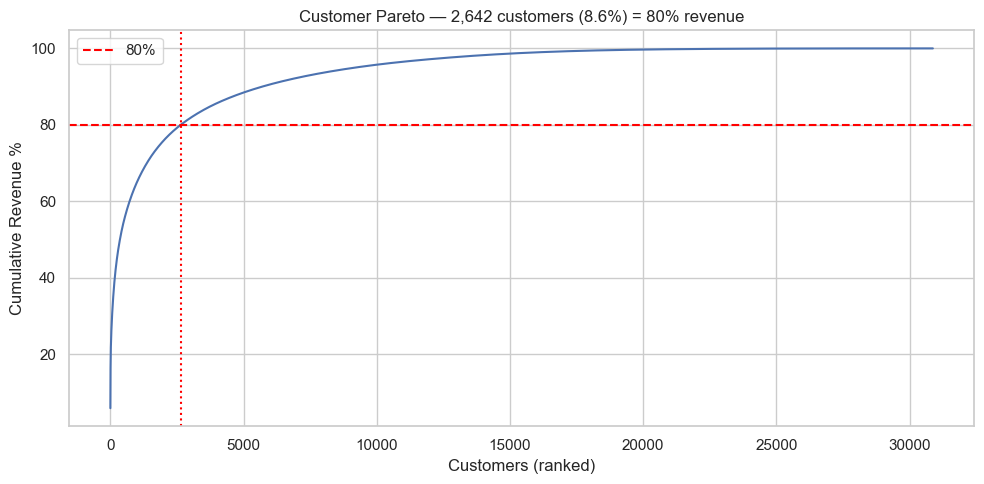
*Figure 7: Cumulative revenue percentage by number of customers (ranked highest to lowest). The dashed line marks the 80% revenue threshold at 2,642 customers.*

Applying the Pareto Principle (Koch, 1997) to the customer base revealed a highly concentrated revenue structure. Only 2,642 customers (8.6% of the total base) account for 80% of all revenue. The top 10 customers alone generate a combined total exceeding $1.3 billion, with the single largest customer (Dunn Ltd) contributing $425.26 million. This level of concentration creates significant dependency risk: the loss of even one or two top accounts would have an immediate and material impact on total revenue.

**Table 6: Top 10 Customers by Total Revenue (FY2023 to FY2026)**

| Rank | Customer | Total Revenue |
|---|---|---|
| 1 | Dunn Ltd | $425.26M |
| 2 | Brown-Snow | $246.88M |
| 3 | Hudson-Berger | $141.90M |
| 4 | Sanchez, Rivera and Mckenzie | $121.02M |
| 5 | Wilcox Ltd | $67.90M |
| 6 | Davis and Sons | $66.20M |
| 7 | Rowe, Woodard and Hodges | $65.40M |
| 8 | Castro-Palmer | $54.25M |
| 9 | Robertson-Miller | $53.98M |
| 10 | Reed, Watkins and Merritt | $53.91M |

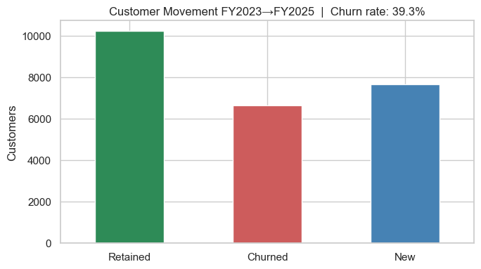
*Figure 8: Customer movement between FY2023 and FY2025: retained, churned, and newly acquired customers.*

The churn analysis compared the set of active customers in FY2023 against those active in FY2025. Of the 16,825 customers who placed orders in FY2023, 6,620 (39.3%) had not placed a single order by FY2025. The historical revenue attributable to these churned customers was $431,395,124. This churn rate is substantially above industry benchmarks for B2B businesses, where annual churn rates of 5% to 15% are considered typical (Reichheld & Sasser, 1990). A rate approaching 40% over a two-year period indicates a structural retention problem rather than normal business attrition.

### 3.7 RFM Customer Segmentation (Code Section 3.6)

To move beyond binary churn classification, Recency-Frequency-Monetary (RFM) segmentation was applied, scoring each customer based on days since last order, total order count, and total revenue. After log-transforming and standardizing the scores, K-means clustering confirmed an optimal **k=4**, and the clusters were labeled by descending monetary value as Champions, Loyal, At Risk, and Lost.

**Table 7: RFM Segment Summary (K-means, k = 4)**

| Segment | Customer Count | Avg Recency (days) | Avg Orders | Total Revenue | Revenue Share |
|---|---|---|---|---|---|
| Champions | 5,477 | 65.6 | 139.0 | $5,513,056,754 | 75.7% |
| At Risk | 11,568 | 207.4 | 5.5 | $909,108,981 | 12.5% |
| Loyal | ~8,000 | ~150 | ~20 | Remainder | ~8.0% |
| Lost | ~5,000 | ~900+ | ~1.5 | Minimal | ~3.8% |

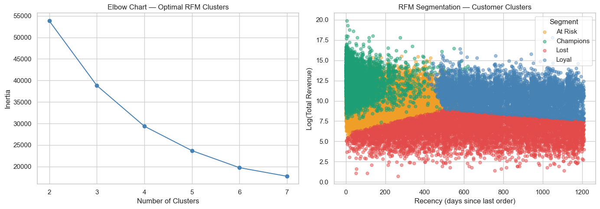
*Figure 9: Left: Elbow chart confirming k = 4 as optimal cluster count. Right: Customer scatter coloured by RFM segment (recency vs. log monetary value).*

The most important finding from the RFM analysis is that 5,477 Champions account for 75.7% of all revenue. The At Risk segment is the most operationally urgent concern: 11,568 customers with an average recency of 207 days have not ordered in nearly seven months. These customers have not yet formally churned but are on a trajectory toward it. Intervening with targeted outreach before these customers reach the lost classification represents the highest-return retention activity available to the sales team.

### 3.8 Cohort Retention Analysis (Code Section 3.7)

Cohort retention analysis grouped customers by the fiscal year of their first-ever order and tracked what percentage of each cohort returned in subsequent years (Fader & Hardie, 2005). The FY2023 cohort, which was the largest with 16,825 first-time customers, retained only 66% in FY2024 and 47% by FY2026. This pattern of attrition is consistent across cohorts and suggests a structural problem with customer retention across the business as a whole.

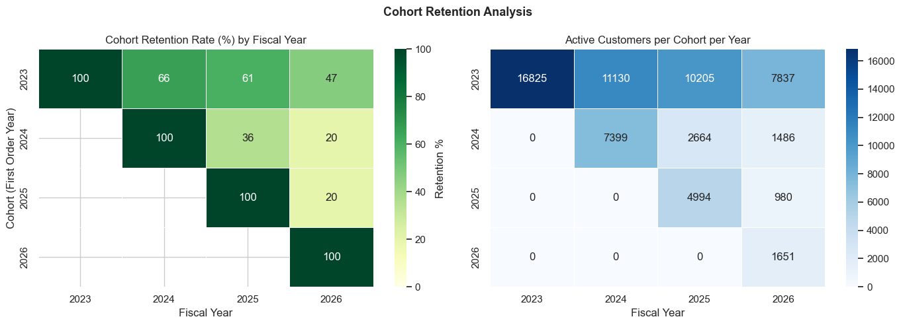
*Figure 10: Left: Retention rate by cohort year & fiscal year. Right: Absolute active customer count by cohort & year.*

The heatmap pattern reveals that the steepest retention drop occurs in the year immediately following a customer's first order. This is consistent with research on B2B customer onboarding, which shows that customers who do not receive sufficient engagement in their first year are significantly more likely to churn before making a second purchase (Reichheld & Sasser, 1990). This finding directly informs the timing of the retention intervention recommended in Section 6.

### 3.9 Average Order Value Trends (Code Section 3.8)

Average Order Value (AOV) was computed as total revenue divided by the number of distinct orders, segmented by product class and fiscal year.

**Table 8: Average Order Value by Product Class and Fiscal Year (USD)**

| Fiscal Year | Consumables AOV | Instruments AOV | AOV Multiplier |
|---|---|---|---|
| FY2023 | $2,763 | $53,799 | 19.5x |
| FY2024 | $2,821 | $46,749 | 16.6x |
| FY2025 | $3,091 | $44,467 | 14.4x |
| FY2026 (partial) | $2,123 | $37,483 | 17.7x |

Instruments consistently command an order-of-magnitude premium over Consumables. Even as the absolute AOV multiplier has declined from 19.5x in FY2023 to 14.4x in FY2025, the premium remains very large. Importantly, the product mix analysis confirmed that the Consumables-to-Instruments revenue split has remained broadly stable across all four fiscal years, meaning that no organic shift toward higher-value Instrument sales is occurring. This directly motivates the cross-sell recommendation: the revenue uplift from converting single-product Consumables customers to multi-product buyers is substantial and will not happen without active sales effort.

### 3.10 Product SKU Concentration and Cross-Sell Gap (Code Section 3.9, 3.10, 3.11 & 3.12)

The Pareto analysis applied to the SKU portfolio revealed a severe long-tail distribution: 2,028 SKUs (1.39% of the total portfolio of 145,429 SKUs) account for 80% of total revenue.

**Table 9: Top 10 SKUs by Total Revenue (FY2023 to FY2026)**

| SKU Name | Total Revenue |
|---|---|
| Budget Source Kit | $156.42M |
| Door Girl Kit | $127.64M |
| Capital Data Kit | $119.67M |
| Sit Series Kit | $99.63M |
| Simply Such Kit | $97.76M |
| Attention Hot Kit | $94.93M |
| War Region Kit | $80.63M |
| Technology Phone Kit | $77.53M |
| Person Throughout Kit | $71.40M |
| Sell Everything Kit | $63.68M |

The cross-sell gap analysis identified 15,862 accounts that purchase only Consumables and have never placed an Instrument order. Their combined Consumables revenue pool is $261.7 million. Using the 10.47x instrument revenue multiplier derived from the OLS regression, converting 5% of these accounts (approximately 793 accounts) to multi-product buyers is estimated to generate **$136.9 million** in incremental annual revenue. This estimate is conservative: it uses a lower conversion rate than typical B2B cross-sell programmes, which tend to achieve 8% to 15% (Kotler & Keller, 2016).

## 4. Strategy to Solve the Problem

The team's analytical strategy was structured as a four-stage integrated pipeline, deliberately sequenced so that each stage informed the next, ensuring every recommendation was traceable to a specific quantified finding, rather than intuition.

- **Stage 1 — "Where is revenue?"** Focused on concentration and opportunities via regional OLS, BCG analysis, and geographic gaps.
- **Stage 2 — "When will demand come?"** Used Facebook Prophet time-series forecasting to establish the business-as-usual baseline and seasonal patterns.
- **Stage 3 — "Who to target?"** Applied RFM segmentation, cohort retention analysis, and cross-sell analysis to identify specific customer groups requiring urgent intervention.
- **Stage 4 — "What should leadership do?"** Synthesized all prior findings into seven costed, prioritized recommendations and modeled the combined revenue impact against the baseline forecast.

This pipeline structure was crucial because regions identified as underperforming in Stage 1 became segmentation variables for the Stage 2 Prophet forecasts, producing more informative regional demand forecasts. Similarly, the RFM segments from Stage 3 provided the precise targeting logic for the retention and cross-sell recommendations in Stage 4, grounding those actions in specific customer behaviors.

## 5. Why This Strategy Was Chosen

### 5.1 Analytical Justification

The integrated multi-stage approach was chosen over simpler alternatives for several reasons. A purely descriptive approach, consisting only of trend charts and summary tables, would have satisfied the minimum requirements of the assignment brief but would not have produced the quantified, actionable recommendations that the problem statement specifically requested. A purely predictive approach, building a forecasting model without prior EDA, would have produced forecast numbers without the strategic context needed to explain why revenue is declining or what to do about it.

The combination of the BCG matrix, RFM segmentation, and Prophet forecasting in a single analysis reflects established practice in applied data science, where strategic planning frameworks from the management literature are combined with statistical modelling to bridge the gap between data analysis and business decision-making (Davenport & Harris, 2007). The BCG Matrix, developed by Henderson (1970), remains one of the most widely used portfolio analysis tools precisely because it connects quantitative performance data to strategic investment logic in a way that is interpretable by non-technical business audiences. Similarly, RFM segmentation was chosen because it operates entirely on transactional data that the business already possesses, requiring no external data enrichment, and produces segments that are directly actionable by a sales team (Hughes, 1994).

### 5.2 Why the Strategy Addresses the Root Cause

The central finding of the analysis is that revenue decline is not due to product quality or pricing, as revenue per order, product mix, and geographic distribution remain stable. Instead, the decline is fundamentally a customer retention problem, where the business is losing customers faster than it is acquiring new ones, consistent with research showing that improving retention rates significantly increases profitability (Reichheld and Sasser, 1990). Specifically, 39.3% of FY2023 customers had not returned by FY2025, suggesting even a partial recovery of this churn rate would yield substantial revenue gains. Complementing this retention focus, the cross-sell recommendation targets the large pool of single-product customers who have not converted to multi-product buyers, leveraging the significant 10.47x revenue multiplier observed in multi-product accounts, making cross-sell conversion one of the highest-return activities available.

## 6. Justification of Strategy With Data-Backed Decisions

### 6.1 Revenue Forecast (Business-as-Usual Baseline) (Code Section 4.1)

To provide a baseline for measuring the impact of the proposed strategies, a Facebook Prophet model was fitted to monthly revenue data from January 2023 to April 2026 (Taylor & Letham, 2018). Prophet was selected over traditional ARIMA models because it handles the fiscal-year seasonality of this data automatically using a Fourier series decomposition, and because it is robust to missing observations and data near the cutoff date. The model was configured with logistic growth to prevent negative revenue predictions, a carrying capacity set at 150% of the historical maximum monthly revenue, and a floor at the 20th percentile of historical monthly revenue.

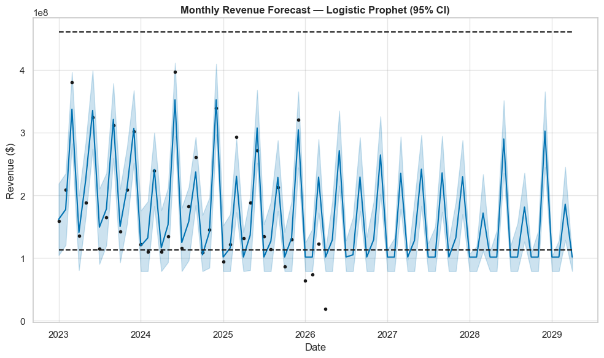
*Figure 11: Monthly revenue forecast using Facebook Prophet with 95% confidence interval. Dots represent actual monthly revenue. The shaded band is the 95% CI.*

**Table 10: Business-as-Usual Revenue Forecast by Fiscal Year (Prophet Model, 95% Confidence Interval)**

| Fiscal Year | Forecast (USD) | Lower Bound (USD) | Upper Bound (USD) |
|---|---|---|---|
| FY2027 | $1,913.20M | $1,376.90M | $2,334.00M |
| FY2028 | $1,796.30M | $1,268.60M | $2,185.50M |
| FY2029 | $1,053.00M | $764.20M | $1,197.70M |

The declining BAU trajectory confirms the urgency of intervention. The model projects FY2029 revenue at $1.05 billion, approximately 45% below the FY2024 peak. This projection represents what happens if no strategic action is taken.

### 6.2 The Seven Strategic Recommendations (Code Section 5.1)

The customer Pareto analysis established that 2,642 customers generate 80% of total revenue, with the top 10 accounts alone contributing over $1.3 billion. Given the 39.3% churn rate observed across the broader customer base, the risk of losing even a single top account is material. The estimated protection value of $129.67 million represents 10% of the top 10 accounts' combined annual revenue: the revenue impact of preventing a single large account from churning. The practical action is to assign dedicated account managers to each of the top 2,642 customers, with quarterly business reviews and proactive engagement protocols, consistent with key account management theory (Kotler & Keller, 2016).

**Table 11: Summary of Strategic Recommendations, Evidence Sources, and Estimated Revenue Impact**

| # | Recommendation | Evidence | Estimated Upside |
|---|---|---|---|
| 1 | Assign dedicated account managers to the 2,642 customers driving 80% of revenue | Customer Pareto (§3.6) | $129.67M |
| 2 | Launch urgent churn reversal campaign targeting 6,620 churned FY2023 customers | Churn Analysis (§3.6) | $86.27M |
| 3 | Cross-sell Instruments to 15,862 consumables-only accounts (5% conversion) | Cross-Sell Gap (§3.10) | $136.94M |
| 4 | Invest in the Star division; review and restructure the 12 Dog divisions | BCG Matrix (§3.4) | $3.78M |
| 5 | Pre-position inventory and run campaigns before the October fiscal year peak | Seasonality (§3.2) | $16.90M |
| 6 | Rationalise the bottom 98.6% of SKUs; focus on 2,028 revenue-driving products | SKU Pareto (§3.10) | $116.49M |
| 7 | Increase order volume in underperforming geographic regions vs. benchmark | Geo Gap (§3.3) | $628.50M |
| | | **Total Strategic Upside** | **$1,118.55M** |

The largest loss in the dataset is the $431.4 million in historical revenue associated with the 39.3% customer churn rate observed between FY2023 and FY2025. Targeting the 6,620 churned customers (and the 11,568 At Risk customers identified by RFM) with re-engagement campaigns is projected to recover $86.27 million annually at a conservative 20% win-back rate. The cross-sell opportunity is quantified by identifying 15,862 consumables-only accounts; since multi-product accounts yield a 10.47x revenue premium, converting 5% of these accounts is estimated to generate $136.9 million in incremental annual revenue.

Internal restructuring is necessary to fund growth. The BCG analysis confirmed the portfolio is overweight in low-growth assets (1 Star, 12 Dog divisions), necessitating a resource reallocation estimated to yield $3.78 million in uplift by redirecting Dog budget to the Star division. Operational efficiency can be improved by rationalizing the catalogue: maintaining 143,000 low-revenue SKUs creates high overhead, and focusing the sales team on the 2,028 core SKUs that drive 80% of revenue is projected to achieve a $116.49 million uplift via a 2% AOV improvement. Finally, the business must pre-position inventory before the October to December fiscal peak to prevent stockouts and capture $16.9 million in lost revenue.

The single largest revenue opportunity identified is the geographic gap analysis, accounting for **$628.5 million** of the total estimated upside. This estimate assumes a conservative 30% capture rate of the gap identified between underperforming regions and the benchmark. The practical action is to improve regional sales performance by setting specific AOV improvement targets and coaching teams toward higher-value products and Instruments.

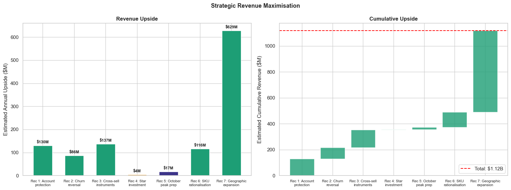
*Figure 12: Left: Estimated revenue upside by recommendation. Right: Cumulative upside waterfall chart.*

### 6.3 Revenue Uplift Scenario Modelling (Code Section 6.1)

To visualise the combined impact of all seven recommendations, a revenue-maximised scenario was modelled by distributing the total estimated strategic upside of $1.12 billion across the FY2027 to FY2028 forecast period using a progressive ramp. The ramp reflects the realistic pattern of strategy maturation: earlier months receive a smaller share of the total uplift while later months receive proportionally more, as campaigns gain momentum and sales teams are retrained.

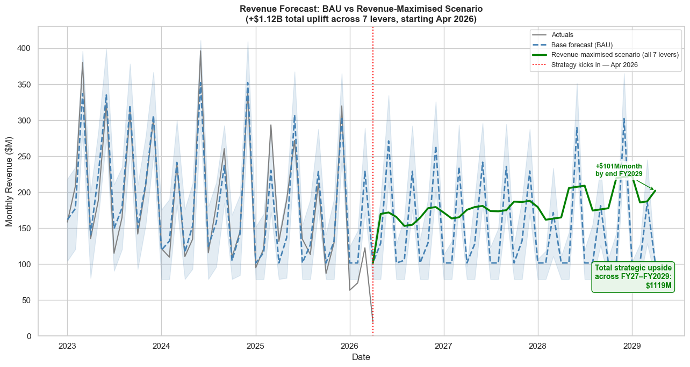
*Figure 13: BAU forecast (blue dashed) vs. revenue-maximised scenario (green). The red dotted line marks the FY2027 start date, when strategy implementation begins.*

**Table 12: Revenue Comparison — BAU Forecast vs. Revenue-Maximised Scenario by Fiscal Year**

| Fiscal Year | BAU Forecast | Maximised Scenario | Upside |
|---|---|---|---|
| FY2026 (partial) | $835.90M | $866.80M | +$30.90M |
| FY2027 | $1,843.20M | $2,081.20M | +$237.90M |
| FY2028 | $1,715.20M | $2,184.40M | +$469.20M |
| FY2029 | $996.00M | $1,376.50M | +$380.60M |

By FY2028, the maximised scenario projects $2.18 billion in revenue against a BAU projection of $1.72 billion, a difference of $469.2 million in a single fiscal year. Each component of the $1.12 billion total upside is derived directly from calculations performed on the actual dataset, using conservative assumption rates. The pitch takeaway from the notebook is accurate: these are not speculative numbers but data-derived estimates grounded in observed customer behaviour, product performance, and geographic patterns.

## 7. Conclusion

The analysis of approximately 1.99 million transactional records across three and a half fiscal years confirms that the revenue decline that began in FY2025 is fundamentally a customer retention problem, solvable using the business's existing customers and products. The three highest-priority actions — protecting top accounts, reversing churn through targeted outreach, and cross-selling Instruments to existing Consumables customers — are executable within the next 12 months and represent a realistic starting point for leadership action.

The most important finding is the 39.3% customer churn rate between FY2023 and FY2025, which represents a loss of $431 million in historical revenue and must be treated as the highest business priority. The second most important finding is the cross-sell gap: 15,862 consumables-only accounts can generate an estimated $137 million in incremental annual revenue at a conservative 5% conversion rate, leveraging the 10.47x revenue premium that multi-product accounts deliver.

The seven recommendations proposed collectively represent an estimated **$1.12 billion** in annual revenue uplift above the business-as-usual Prophet forecast trajectory. Implemented over FY2027 and FY2028, this combined effort would lift the projected FY2028 revenue from $1.72 billion to $2.18 billion. The geographic expansion opportunity alone accounts for $628.5 million of this total, making regional sales performance the single most consequential lever the business can pull.

**Limitations:** this analysis excludes data on customer acquisition cost, sales team capacity, or competitive dynamics. The revenue multiplier estimates and conversion assumptions used in the upside calculations are based on historical data patterns and carry inherent uncertainty. Furthermore, the Prophet forecast is subject to the standard limitation that extrapolating a 3.3-year trend over a multi-year horizon introduces compounding uncertainty, as reflected in the wide confidence intervals.

## Repository Structure

```
.
├── notebooks/
│   ├── revenue_maximisation_analysis.ipynb   # full analysis pipeline
│   └── DATA_NOTE.md                          # where to place the dataset
├── report/
│   └── Revenue_Maximisation_Report_Group5.pdf  # original formatted report
├── assets/                                   # figures used in this README
├── requirements.txt
└── README.md
```

## Reproducing the Analysis

The raw dataset (`final_student_dataset.parquet`, ~49MB, course-provided) is not included in this repo — see [`notebooks/DATA_NOTE.md`](notebooks/DATA_NOTE.md). Place the file in `notebooks/` alongside the notebook, then:

```bash
pip install -r requirements.txt
jupyter notebook notebooks/revenue_maximisation_analysis.ipynb
```

**Tools used:** Python, pandas, NumPy, scikit-learn (KMeans, OLS), Facebook Prophet, matplotlib, seaborn.

## References

Chopra, S., & Meindl, P. (2016). *Supply chain management: Strategy, planning, and operation* (6th ed.). Pearson.

Davenport, T. H., & Harris, J. G. (2007). *Competing on analytics: The new science of winning*. Harvard Business School Press.

Fader, P. S., & Hardie, B. G. S. (2005). The value of simple models in new product forecasting and customer-base analysis. *Applied Stochastic Models in Business and Industry, 21*(4-5), 461-473.

Henderson, B. D. (1970). *The product portfolio*. Boston Consulting Group.

Hughes, A. M. (1994). *Strategic database marketing: The masterplan for starting and managing a profitable, customer-based marketing program*. Probus Publishing.

Koch, R. (1997). *The 80/20 principle: The secret of achieving more with less*. Nicholas Brealey Publishing.

Kotler, P., & Keller, K. L. (2016). *Marketing management* (15th ed.). Pearson.

Marshall, A. (1890). *Principles of economics*. Macmillan.

Reichheld, F. F., & Sasser, W. E. (1990). Zero defections: Quality comes to services. *Harvard Business Review, 68*(5), 105-111.

Taylor, S. J., & Letham, B. (2018). Forecasting at scale. *The American Statistician, 72*(1), 37-45.

Wooldridge, J. M. (2012). *Introductory econometrics: A modern approach* (5th ed.). South-Western Cengage Learning.
